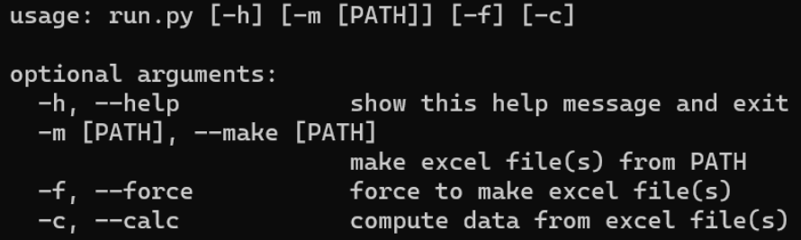

# XMaker

---

- #### 安装

  ```bash
  pip install -r requirements.txt
  ```

- #### 帮助

  进入 run.py 所在目录，中断运行

  ```
  python run.py -h
  ```

  

  如何编辑

  进入 utils/config.py 文件，找到 CONFIG.PARGS，进行自定义编辑

  ```python
  CONFIG = {
      "PARGS": [
          {
              "main": "data",
              "key": "make",
              "args": [],
              "kwargs": {
                  "nargs": "?",
                  "metavar": "PATH",
                  "help": "make excel file(s) from PATH",
              },
          },
          {
              "key": "force",
              "args": [],
              "kwargs": {
                  "action": "store_true",
                  "help": "force to make excel file(s)",
              },
          },
          {
              "key": "calc",
              "args": [],
              "kwargs": {
                  "action": "store_true",
                  "help": "compute data from excel file(s)",
              },
          },
      ],
  }
  ```

  \*注意：

  每个参数至少需要包含 \[key, args, kwargs\] 三个模块

  其中，key 为参数全名；args 为长短参数，默认为空；kwargs 和 argparser 的添加函数 add_argument 的参数保持一致，详情见官方文档[argparse 教程 — Python 3.12.0 文档](https://docs.python.org/zh-cn/3/howto/argparse.html)

- 运行

  ```bash
  python run.py -m #默认执行，缺省文件夹为data\
  python run.py -m <PATH> #指定路径生成目标表格文件
  python run.py -m <PATH> -f #强制执行，即使目标表格存在，仍然再次生成
  python run.py -m <PATH> -c #生成并计算目标值
  python run.py -m <PATH> -f -c #强制生成并计算 #-m, -f, -c顺序任意
  ```

- 状态控制

  支持状态：IO <生成（转化）, 保存>、运算、异常<只读，中断>

  |                  执行                  |                             输出                             |                           数据状态                           |
  | :------------------------------------: | :----------------------------------------------------------: | :----------------------------------------------------------: |
  | python run.py 或<br />python run.py -m |           目录：`<PATH>` 没有['.dat', '.flow']文件           | `` |
  |      python run.py -m data\data1       | `` | ``<br />耗时生成 |
  |                  同 ↑                  | `` |                        已存在，不耗时                        |
  |                  同 ↑                  | `` |          打开一个表格<br />同时 Ctrl+C 中断一个转化          |
  |     python run.py -m data\data1 -f     | `` |                强制耗时生成<br />同时给予中断                |
  |     python run.py -m data\data1 -c     | `` |                         附带运算结果                         |
  |   python run.py -m data\data1 -f -c    | `` |             强制耗时生成和计算<br />同时给予中断             |
